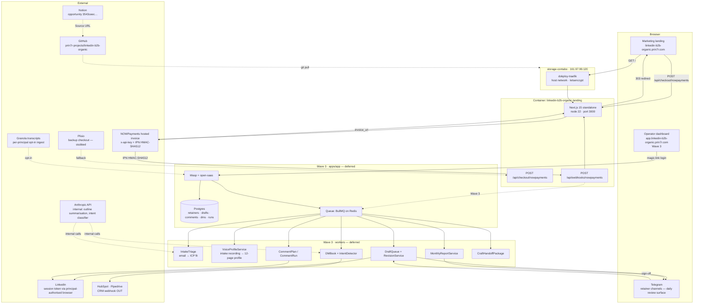
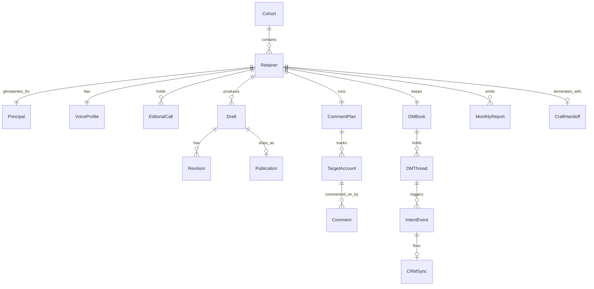

# 12 — Technical Specification

This is the authoritative technical contract for Bylineship spanning Wave 2 (the marketing landing — shipped) and Wave 3 (the operator dashboard + draft queue + comment plan + DM book + CRM webhook — deferred). Doc 11 specifies user-visible flows; this doc specifies runtime, data model, contracts, integrations, security posture, observability, performance budgets, and explicit non-goals. Every endpoint here traces back to a story in doc 11 §2 or a scenario in doc 11 §3.

The shipped Wave 2 surface is small (a Next.js 15 landing + a NOWPayments hosted-invoice checkout + an HMAC-SHA512-verified IPN webhook on `storage-contabo`). The deferred Wave 3 surface is larger and is what most of this document specifies — written so the next agent can build without re-deriving the brand or the cohort cadence.

---

## 1. Architecture overview

Bylineship is a **high-touch retainer operations system**. The marketing landing is intentionally thin (no auth, no PII, no cookies). The retainer-operations dashboard is the Wave 3 product: it ingests voice intakes, holds the drafts queue, runs the comment plan, manages the DM book, fires the CRM webhook on intent detection, and emits the monthly accuracy report. The cohort cap (6 retainers/month, hard ceiling 16-18 under management) is enforced in software, not just in the head writer's calendar.



---

## 2. Data model

### 2.1 Entities (Wave 3)



### 2.2 Schema sketch (Drizzle / Postgres — Wave 3 deferred)

```typescript
export const cohorts = pgTable('cohorts', {
  id: uuid('id').primaryKey().defaultRandom(),
  monthIso: text('month_iso').notNull().unique(),     // '2026-06'
  intakeOpensAt: timestamp('intake_opens_at').notNull(),
  intakeClosesAt: timestamp('intake_closes_at').notNull(),
  capMax: integer('cap_max').default(6).notNull(),    // structural — never raised in code
  filledCount: integer('filled_count').default(0).notNull(),
});

export const principals = pgTable('principals', {
  id: uuid('id').primaryKey().defaultRandom(),
  email: text('email').notNull().unique(),
  fullName: text('full_name').notNull(),
  companyName: text('company_name').notNull(),
  role: text('role').notNull(),                       // 'VP Operations', 'Founder/CEO', etc.
  linkedinUrl: text('linkedin_url').notNull(),
  followerCountAtIntake: integer('follower_count_at_intake'),
  arrAtIntakeUsd: integer('arr_at_intake_usd'),
  industry: text('industry'),
  telegramChannelId: text('telegram_channel_id'),
});

export const retainers = pgTable('retainers', {
  id: uuid('id').primaryKey().defaultRandom(),
  cohortId: uuid('cohort_id').references(() => cohorts.id),
  principalId: uuid('principal_id').references(() => principals.id),
  tier: text('tier').notNull(),                       // 'founder' | 'operator' | 'director' | 'studio'
  monthlyUsd: integer('monthly_usd').notNull(),       // 1490 | 2990 | 4990 | custom
  status: text('status').default('pending').notNull(),// 'pending'|'active'|'paused'|'cancelled'
  startedAt: timestamp('started_at'),
  cancelledAt: timestamp('cancelled_at'),
  annualPrepay: boolean('annual_prepay').default(false),
  cohortSlotsConsumed: integer('cohort_slots_consumed').default(1).notNull(),  // Studio = 2
  assignedHeadWriter: text('assigned_head_writer').default('Lila'),
  assignedSeniorWriter: text('assigned_senior_writer'),
  crmConfigJson: jsonb('crm_config_json'),            // {provider:'hubspot'|'pipedrive', webhookUrl, fieldMap}
  intentKeywords: text('intent_keywords').array().default(['meeting','15 minutes','compare notes','discovery','call']),
});

export const voiceProfiles = pgTable('voice_profiles', {
  id: uuid('id').primaryKey().defaultRandom(),
  retainerId: uuid('retainer_id').references(() => retainers.id),
  intakeRecordingUrl: text('intake_recording_url'),
  voiceTicsJson: jsonb('voice_tics_json'),            // 8 patterns
  ownedThemesJson: jsonb('owned_themes_json'),        // 12 themes
  antiThemesJson: jsonb('anti_themes_json'),          // 5 anti-themes
  samplePost: text('sample_post'),
  podcastBio: text('podcast_bio'),
  pdfUrl: text('pdf_url'),
  generatedAt: timestamp('generated_at'),
  lastReviewedAt: timestamp('last_reviewed_at'),
});

export const drafts = pgTable('drafts', {
  id: uuid('id').primaryKey().defaultRandom(),
  retainerId: uuid('retainer_id').references(() => retainers.id),
  weekIso: text('week_iso'),                          // '2026-06-W2'
  scheduledShipAt: timestamp('scheduled_ship_at'),
  status: text('status').default('drafting').notNull(),// 'drafting'|'senior_review'|'head_review'|'awaiting_principal'|'shipped'|'killed'
  bodyMarkdown: text('body_markdown').notNull(),
  draftedBy: text('drafted_by').notNull(),            // writer id
  reviewedBy: text('reviewed_by'),
  shippedAt: timestamp('shipped_at'),
  linkedinPostUrl: text('linkedin_post_url'),
  killReason: text('kill_reason'),
});

export const revisions = pgTable('revisions', {
  id: uuid('id').primaryKey().defaultRandom(),
  draftId: uuid('draft_id').references(() => drafts.id),
  fromBody: text('from_body').notNull(),
  toBody: text('to_body').notNull(),
  initiatedBy: text('initiated_by').notNull(),        // 'principal' | 'senior_writer' | 'head_writer'
  rationale: text('rationale'),
  createdAt: timestamp('created_at').defaultNow().notNull(),
});

export const commentPlans = pgTable('comment_plans', {
  id: uuid('id').primaryKey().defaultRandom(),
  retainerId: uuid('retainer_id').references(() => retainers.id),
  weekIso: text('week_iso'),
  targetAccountCount: integer('target_account_count').notNull(),
  commentsQueued: integer('comments_queued').default(0).notNull(),
  commentsShipped: integer('comments_shipped').default(0).notNull(),
});

export const targetAccounts = pgTable('target_accounts', {
  id: uuid('id').primaryKey().defaultRandom(),
  retainerId: uuid('retainer_id').references(() => retainers.id),
  linkedinUrl: text('linkedin_url').notNull(),
  fullName: text('full_name'),
  role: text('role'),
  company: text('company'),
  addedAt: timestamp('added_at').defaultNow(),
  staleSinceDays: integer('stale_since_days').default(0),
});

export const comments = pgTable('comments', {
  id: uuid('id').primaryKey().defaultRandom(),
  planId: uuid('plan_id').references(() => commentPlans.id),
  targetAccountId: uuid('target_account_id').references(() => targetAccounts.id),
  bodyMarkdown: text('body_markdown').notNull(),
  draftedBy: text('drafted_by').notNull(),
  signedOffBy: text('signed_off_by'),                 // principal
  shippedAt: timestamp('shipped_at'),
  dwellTimeSec: integer('dwell_time_sec'),            // tracked client-side at publish
});

export const dmThreads = pgTable('dm_threads', {
  id: uuid('id').primaryKey().defaultRandom(),
  retainerId: uuid('retainer_id').references(() => retainers.id),
  counterpartyLinkedinUrl: text('counterparty_linkedin_url').notNull(),
  counterpartyName: text('counterparty_name'),
  counterpartyRole: text('counterparty_role'),
  counterpartyCompany: text('counterparty_company'),
  status: text('status').default('warm').notNull(),   // 'warm'|'engaged'|'meeting_booked'|'closed_lost'|'closed_won'
  lastMessageAt: timestamp('last_message_at'),
});

export const intentEvents = pgTable('intent_events', {
  id: uuid('id').primaryKey().defaultRandom(),
  threadId: uuid('thread_id').references(() => dmThreads.id),
  triggeredBy: text('triggered_by').notNull(),        // matched keyword
  rawMessageBody: text('raw_message_body').notNull(),
  detectedAt: timestamp('detected_at').defaultNow().notNull(),
  falsePositive: boolean('false_positive'),           // Lila weekly retro flag
  crmSyncedAt: timestamp('crm_synced_at'),
});

export const monthlyReports = pgTable('monthly_reports', {
  id: uuid('id').primaryKey().defaultRandom(),
  retainerId: uuid('retainer_id').references(() => retainers.id),
  monthIso: text('month_iso'),
  followersStart: integer('followers_start'),
  followersEnd: integer('followers_end'),
  relationshipsStarted: integer('relationships_started'),
  dmsSent: integer('dms_sent'),
  dmsBecameMeeting: integer('dms_became_meeting'),
  podDetectionFlag: boolean('pod_detection_flag').default(false),
  shippedAt: timestamp('shipped_at'),
});

export const craftHandoffs = pgTable('craft_handoffs', {
  id: uuid('id').primaryKey().defaultRandom(),
  retainerId: uuid('retainer_id').references(() => retainers.id),
  packageS3Url: text('package_s3_url'),
  expiresAt: timestamp('expires_at'),                 // 7-day signed
  shippedAt: timestamp('shipped_at'),
});
```

Indexes: `retainers(cohortId, status)`, `drafts(retainerId, weekIso, status)`, `comments(planId, shippedAt)`, `intentEvents(detectedAt, falsePositive)`, `monthlyReports(retainerId, monthIso)`.

---

## 3. API contracts

Wave 2 has only routes 3.1, 3.2, 3.3 shipped. Routes 3.4-3.18 are Wave 3 deferred. Each maps to a story or scenario in doc 11.

### Wave 2 — shipped on `landing` container

#### 3.1 `POST /api/checkout/nowpayments` *(US-03)*
- Auth: none (public landing).
- Body: `{ tier: 'founder'|'operator'|'director' }`.
- Validates tier id; rejects unknown tiers with 400.
- Reads `NOWPAYMENTS_API_KEY` from `process.env`.
- POSTs `https://api.nowpayments.io/v1/invoice` with `{ price_amount, price_currency:'usd', order_id, ipn_callback_url, success_url, cancel_url }`.
- Returns 201: `{ invoice_url, invoice_id }`.
- Errors: 429 if NOWPayments rate-limits (Plisio fallback path documented in EC-5).

#### 3.2 `POST /api/webhooks/nowpayments` *(US-03)*
- Auth: HMAC-SHA512 over JSON-canonicalised body using `NOWPAYMENTS_IPN_SECRET`.
- Reads `x-nowpayments-sig`, recomputes HMAC, compares with `crypto.timingSafeEqual` over hex buffers.
- On match: writes `[BYLINESHIP_NOWPAYMENTS_IPN]` audit log line, returns 200. Wave 3 additionally enqueues `RetainerActivationJob`.
- On mismatch: returns 401 (provider retries).
- Idempotent on `(orderId, paymentStatus)`.

#### 3.3 `GET /` and `GET /thanks` *(landing pages)*
- Static. No PII, no auth, no cookies.

### Wave 3 — deferred operator surface

#### 3.4 `POST /api/intake/email-ingest` *(US-01, US-02)*
- Auth: SES inbound webhook (or Postmark inbound) HMAC-verified.
- Body: parsed inbound email (`from`, `subject`, `bodyText`, `messageId`).
- Routes to `IntakeTriageService` which scores ICP fit (5 qualifying criteria from doc 05) and posts the result to Lila's Slack `#intake-triage` channel for human triage.
- Returns 200 or 401.

#### 3.5 `POST /api/cohorts/:monthIso/retainers` *(US-02, Scenario 1)*
- Auth: head-writer JWT (Wasp role `head_writer`).
- Body: `{ principalEmail, principalName, tier, intakeNotes }`.
- Validates cohort cap (`cohorts.filledCount + slotsForTier ≤ capMax`); rejects with 409 `CohortFull` if at cap.
- Creates `retainers` row with `status='pending'`, awaiting payment.
- Returns 201: `{ retainerId, paymentLink }`.

#### 3.6 `POST /api/retainers/:id/activate` *(US-03, Scenario 1 step 8)*
- Internal — fired from the IPN handler post-HMAC verify.
- Idempotent on `(retainerId, paymentStatus)`.
- Sets `retainers.status='active'`, `startedAt=now()`, increments `cohorts.filledCount`.
- Triggers Telegram nudge to Lila.

#### 3.7 `POST /api/retainers/:id/voice-profile` *(US-04, Scenario 2 step 2)*
- Auth: head-writer JWT.
- Body: `{ intakeRecordingUrl, voiceTicsJson, ownedThemesJson, antiThemesJson, samplePost, podcastBio }` plus generated PDF URL.
- Returns 201; triggers Telegram delivery to principal.

#### 3.8 `POST /api/drafts` *(US-05, US-06, Scenario 3)*
- Auth: writer JWT (head or senior).
- Body: `{ retainerId, weekIso, scheduledShipAt, bodyMarkdown }`.
- Status defaults to `drafting`; transitions through `senior_review → head_review → awaiting_principal` via PATCH.

#### 3.9 `PATCH /api/drafts/:id` *(US-05, US-06)*
- Auth: writer or principal JWT.
- Body: `{ status?, bodyMarkdown?, killReason? }`.
- State machine enforces legal transitions only (rejects e.g. `drafting → shipped`).

#### 3.10 `POST /api/drafts/:id/ship` *(US-05, Scenario 2 step 6)*
- Auth: principal JWT (or HMAC-signed Telegram one-tap signoff token in EC-10 fallback).
- Calls `LinkedInPublisher.publish(draftBody, principalSession)`. Stores returned `linkedinPostUrl`.
- Sets `drafts.status='shipped'`, `shippedAt=now()`.

#### 3.11 `POST /api/comment-plans/:id/comments` *(US-07, Scenario 3 step 3)*
- Auth: senior writer JWT.
- Body: `{ targetAccountId, bodyMarkdown }`.
- Comments are created with `signedOffBy=null`; principal signs off via Telegram.

#### 3.12 `POST /api/comments/:id/sign-off` *(US-07)*
- Auth: principal JWT.
- Sets `signedOffBy=principalId`. Optional immediate-publish or deferred queue.

#### 3.13 `POST /api/dm-threads/:id/messages` *(US-08, Scenario 3 step 5)*
- Auth: writer JWT.
- Body: `{ draftedBody }`. Principal sees the draft in Telegram, presses send themselves.

#### 3.14 `POST /api/intent-events` *(US-09, Scenario 3 step 6)*
- Internal — fired from `IntentDetector` when a DM thread message matches a keyword.
- Body: `{ threadId, triggeredBy, rawMessageBody }`.
- Triggers `CRMWebhook.fire(retainer.crmConfigJson, payload)`.

#### 3.15 `PATCH /api/intent-events/:id/false-positive` *(EC-4)*
- Auth: head-writer JWT.
- Sets `falsePositive=true`. Used for the weekly false-positive retro and (Wave 4) classifier retraining.

#### 3.16 `GET /api/retainers/:id/monthly-reports/:monthIso` *(US-11, EC-9)*
- Auth: principal or head-writer JWT.
- Returns `{ followersStart, followersEnd, relationshipsStarted, dmsSent, dmsBecameMeeting, podDetectionFlag }`.

#### 3.17 `POST /api/retainers/:id/cancel` *(US-12, Scenario 6)*
- Auth: principal JWT (or one-line email handler triggered by Lila).
- Body: `{ refundInflightMonth?: boolean }`.
- Sets `retainers.status='cancelled'`, `cancelledAt=now()`. Disables next-cycle invoice. Queues `CraftHandoffPackage.assemble`.

#### 3.18 `GET /api/retainers/:id/craft-handoff` *(US-12)*
- Auth: principal JWT.
- Returns `{ packageS3Url, expiresAt }`. Signed S3 URL with 7-day TTL.

---

## 4. Integrations

| Service | Purpose | Auth | Rate limit | Fallback |
|---|---|---|---|---|
| **NOWPayments** | Hosted invoice + IPN | `x-api-key` + HMAC-SHA512 | 60 req/min | Plisio (stubbed in `.env.example`); manual USD wire (~10% of retainers) |
| **Postmark / SES** | Inbound intake email + outbound transactional | API token / inbound webhook HMAC | 5k/h Pro | Buffer; retry |
| **Telegram Bot API** | Drafts queue delivery + comment sign-off + monthly reports | Bot token | 30 msg/sec | Email fallback per EC-10 |
| **LinkedIn (publish + DM ingest)** | `LinkedInPublisher` + `DMIngest` | Principal-authorised session token (per principal, refreshed weekly) | LinkedIn rate limits enforced | Manual publish via Lila's calendar block |
| **HubSpot Marketplace** | Outbound CRM webhook | OAuth (per retainer) | 100 req/10s | Pipedrive webhook URL alternative |
| **Pipedrive** | Outbound CRM webhook (alternative) | API token (per retainer) | 80 req/2s | HubSpot alternative |
| **Anthropic API** | Outline summarisation from transcripts; intent classifier (Wave 4) | API key | 4k req/s Sonnet 4.6 | Falls back to Haiku 4.5 with reduced summary quality |
| **Granola** | Transcript ingest (per principal opt-in) | OAuth | n/a | Manual upload |
| **GitHub** | Source control + Notion-link source-of-truth | `gh` CLI | 5k/h | Manual git push |
| **Cloudflare DNS** | `linkedin-b2b-organic.prin7r.com` wildcard | Account-level | 1.2k/5min | Manual A-record |
| **Plisio** | Backup checkout if NOWPayments rate-limits | API key (env stubbed) | n/a | NOWPayments primary |
| **Reown** | Wallet-direct fallback (rare; env stubbed) | n/a (wallet-side) | n/a | Manual USDC wire |

---

## 5. Storage

- **Wave 2 — landing.** Fully stateless. No DB, no cookies, no localStorage. The only persistent artifact is the journalctl audit log of IPN events on `storage-contabo`.
- **Wave 3 — operator dashboard.** Postgres on Coolify (server `144.91.94.91`) — schema in §2.2. WAL-mode; backed up nightly by Coolify's bundled `pg_dump` to S3.
- **Voice intake recordings.** S3 bucket `bylineship-voice-intakes` with default deny + signed-URL-only access; 7-year retention (long enough that even cancelled retainers' future "voice refresh" calls can reference the original).
- **Drafts + revisions.** Indefinite retention. Deleted only on explicit principal request post-cancellation (per GDPR DSAR runbook — Wave 4).
- **Comments + DM threads.** Indefinite retention; comments are part of the cancellation hand-back package.
- **Monthly reports.** Indefinite retention; principal-readable through `GET /api/retainers/:id/monthly-reports/*`.
- **Telegram channel history.** Tracked by Telegram natively; we do not mirror to our DB except for sign-off events (which become draft revisions).
- **Craft hand-off packages.** S3 with 7-day signed URL on cancellation. After 7 days, the package is regenerated on demand via `POST /api/retainers/:id/craft-handoff/regenerate` (gated by principal JWT).

---

## 6. Auth

| Surface | Mechanism | Notes |
|---|---|---|
| Public landing | none | No PII, no cookies |
| Principal dashboard | open-saas magic-link → JWT | Per-retainer; one principal per retainer |
| Head writer | Wasp role `head_writer` | One human (Lila) at a time |
| Senior writers | Wasp role `senior_writer` | 2-4 humans |
| Admin | Bearer + IP allowlist | Keer + on-call ops only |
| Intake email ingest | SES/Postmark inbound HMAC | Verified before triage |
| NOWPayments IPN | HMAC-SHA512 (timing-safe-equal) | Per doc 02 §Security |
| LinkedIn publish session | Per-principal stored cookie/session token | Refreshed weekly via principal-authorised browser session |
| Telegram one-tap signoff | HMAC-signed token | 24h TTL; used in EC-10 fallback |
| Preview / craft-handoff URLs | Signed S3 URL | TTL 24h or 7d depending on use |

Permissions model:

- **Principal** can read/write only their own retainer's drafts, comments, DMs, reports.
- **Senior writer** can read/write the retainers they're assigned to (`retainers.assignedSeniorWriter`).
- **Head writer** can read/write all retainers; the only role allowed to mutate `cohorts.filledCount` and `retainers.status`.
- **Admin** can rotate keys, view audit logs, trigger backup restore. Admin is non-routine — the head writer holds the day-to-day power.

---

## 7. Security — top 5 threats + mitigations

1. **Forged IPN.** *Mitigation:* HMAC-SHA512 of JSON-sorted-keys body; `crypto.timingSafeEqual` over hex buffers; reject 401 on mismatch (provider retries). Per doc 02 §Security.
2. **Principal credential theft (LinkedIn session token).** *Mitigation:* Tokens stored encrypted-at-rest in Postgres (KMS-wrapped DEK); rotated weekly via principal-authorised browser handshake; revoked instantly on cancellation. No bulk export endpoint; only `LinkedInPublisher` can read.
3. **Cohort-cap bypass (someone tries to add a 7th retainer to a closed cohort).** *Mitigation:* `POST /api/cohorts/:monthIso/retainers` enforces `filledCount + slotsForTier ≤ capMax` inside a Postgres transaction with `SERIALIZABLE` isolation; concurrent attempts get one success, one 409.
4. **CRM webhook poisoning (a malicious DM containing intent keywords used to spam a customer's CRM).** *Mitigation:* `IntentDetector` requires the DM thread to be from a *verified target account* (must exist in `targetAccounts` table for that retainer). Random LinkedIn DMs cannot trigger the webhook.
5. **Voice profile leak (a senior writer exfiltrates a retainer's voice tics + anti-themes to a competitor).** *Mitigation:* All voice-profile reads are audit-logged with writer ID + timestamp; weekly head-writer review of the audit log; senior-writer NDA includes a $50k liquidated-damages clause for voice-profile exfiltration. We accept that determined exfiltration is hard to prevent — the mitigation is contractual and cultural, not purely technical.

Cross-cutting:
- CSRF: Wasp + samesite-strict cookies on the dashboard.
- CORS: locked to `linkedin-b2b-organic.prin7r.com` + `app.linkedin-b2b-organic.prin7r.com`.
- HSTS / TLS 1.2+ enforced by Traefik letsencrypt.
- No third-party JS on the landing beyond Google Fonts CSS.
- `.env` only on the host (gitignored). Keys never committed.
- Telegram bot secret rotated quarterly.

---

## 8. Observability

- **Logs.** Stdout JSON `{ ts, level, route, retainerId?, draftId?, event, message, [BYLINESHIP_NOWPAYMENTS_IPN]? }`. PII scrubbed (principal email replaced with hashed retainer id at log boundary). Loki Wave 4+; for Wave 3 MVP, journalctl + grep is the read path.
- **Metrics (Wave 3).**
  - `retainers.active` gauge.
  - `cohort.filled_ratio` per month gauge.
  - `drafts.shipped_per_week` per retainer counter.
  - `comments.dwell_time_seconds` p50/p95 histogram.
  - `dms.intent_events_per_week` counter; `intent_events.false_positive_ratio` weekly gauge.
  - `monthly_reports.churn_signal` (retainer didn't renew within 7d of monthly invoice) counter.
- **Alerts (Slack `#alerts-bylineship`).**
  - Cohort fill rate <80% by day 5 of the month → ping Lila.
  - First-month churn >1/6 in any active cohort → page Lila.
  - NOWPayments IPN failures >3 in 1h → page on-call.
  - Telegram delivery failures >5 in 1h → page on-call.
  - LinkedIn publisher 4xx >2 per retainer per day → ping senior writer.
  - Anthropic API 5xx >5/h → ping on-call.
  - `intent_events.false_positive_ratio` >25% → weekly retro item for Lila.

---

## 9. Performance budgets

| Surface | Metric | Budget |
|---|---|---|
| Landing TTFB | p95 | <200ms |
| Landing LCP | p75 | <2.5s |
| `POST /api/checkout/nowpayments` | p95 | <400ms (excluding NOWPayments upstream) |
| `POST /api/webhooks/nowpayments` HMAC verify + ack | p95 | <120ms |
| Wave 3 dashboard route TTFB | p95 | <250ms |
| Telegram draft delivery (sign-off → ship) | p95 | <90s including LinkedIn publish |
| Intent → CRM webhook | p95 | <60s |
| Voice profile → principal Telegram | p95 | <96 hours from intake call |
| Comment dwell time (per-comment, hand-drafted) | average | ≥9 min |
| Throughput sustained | 18 retainers under management; 6 new retainers/month |
| Cohort intake → cohort full | average | <5 working days; hard cap 5 per doc 09 §Week 1 |

---

## 10. Non-goals

- **No engagement-pod feature** (doc 11 AS-1).
- **No "viral hook" UI** (AS-2).
- **No LLM-generated comments** (AS-3).
- **No follower-count optimisation dashboard** (AS-4).
- **No multi-tenant SaaS pivot / no "Lite" / "Free" / "Self-serve" tier** (AS-5).
- **No referral fees, kickback codes, affiliate panel** (AS-6).
- **No public case studies with logos** (AS-7).
- **No "AI-powered" mentions in product copy** (AS-8).
- **No automated win-back sequence on cancellation.** Cancellation is one email; hand-back is one package; Lila Telegrams once at 30 days.
- **No mobile-native dashboard.** Responsive web only (Telegram is the principal's mobile surface).
- **No multi-page output for the landing.** This site is single-page; doc 11 AS-1 of `landing-pages-on-demand` parallels.
- **No analytics pixels on the landing.** Per doc 02 §Security.
